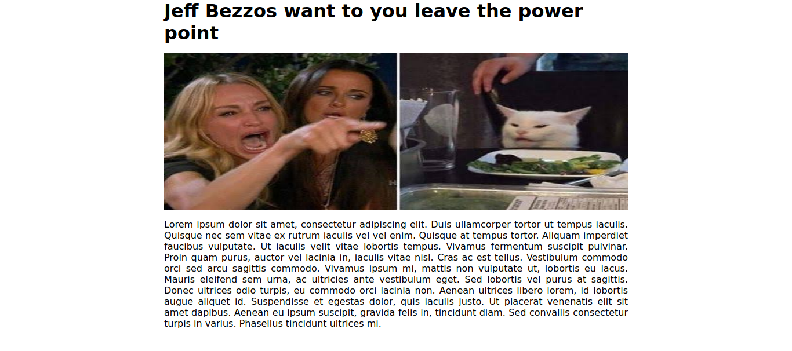
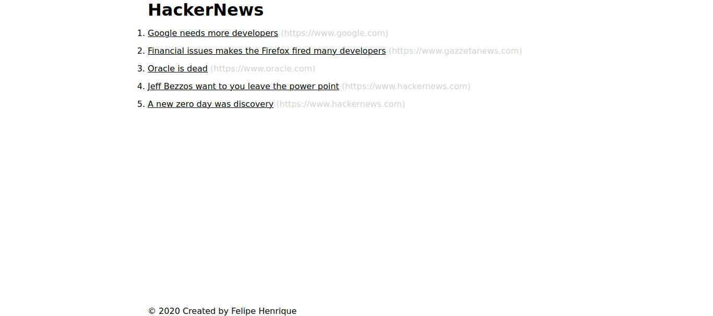

# HackerNews clone 


Um clone simples do hackernews escrito usando apenas o Golang puro sem bibliotecas,
frameworks externos.

## How to use 

Abra seu terminal e digite:

```bash
    go run main.go
```

Depois [acesse](http://localhost:8080/) no seu browser o localhost na porta *8080* e você terá a tela abaixo.

